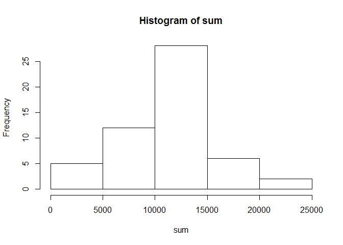
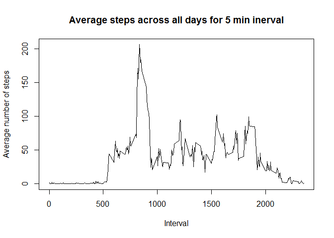
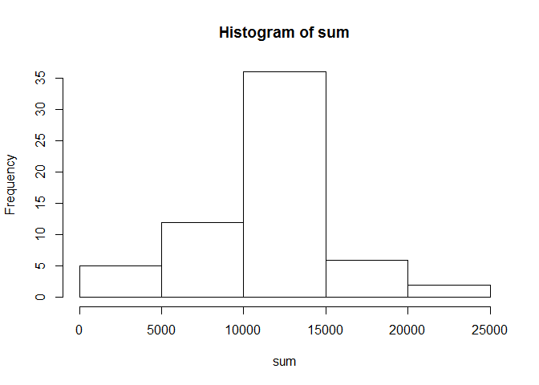
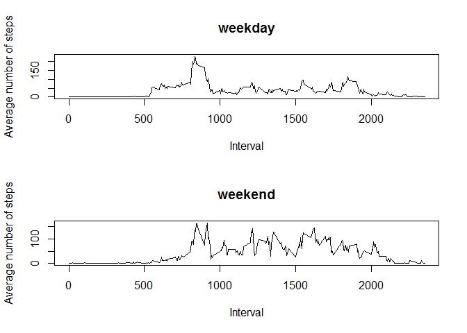

## Loading and preprocessing the data

```r
if(!file.exists("activity.csv"))
  unzip("activity.zip",exdir = ".")

Df <- read.csv("activity.csv")
```

## What is mean total number of steps taken per day?

```r
sum <- tapply(Df$steps,Df$date,sum)
hist(sum)
```

<!-- -->

```r
m <- mean(sum,na.rm= T)
med <- median(sum,na.rm = T)
```
Mean is 1.0766189\times 10^{4}
Median is 10765 

## What is the average daily activity pattern?

```r
avg <- tapply(Df$steps,Df$interval,mean,na.rm=T)
plot(names(avg),avg,type = "l",xlab="Interval",ylab = "Average number of steps", main ="Average steps across all days for 5 min inerval")
```

<!-- -->

```r
maxval<- which(avg == max(avg))
intr <- names(maxval)
```
Interval with max number of steps is 835


## Imputing missing values

```r
newDf <- Df
n <- sum(is.na(newDf$steps))
impute <- function(x) x <- replace(x, is.na(x), mean(x,na.rm = T))
dummy <- tapply(newDf$steps,list(newDf$interval),impute)
ddf <- data.frame(steps=unlist(dummy),date=rep(seq(as.Date("2012-10-01"),as.Date("2012-11-30"),by = "day"),288),interval = rep(as.numeric(names(dummy)),each = 61))
sum <- tapply(ddf$steps,ddf$date,sum)

hist(sum)
```

<!-- -->

```r
m <- mean(sum,na.rm= T)
med <- median(sum,na.rm = T)
```
Number of missing Values is 2304

Mean after imputing is 1.0766189\times 10^{4}
Median after imputing is 1.0766189\times 10^{4}

## Are there differences in activity patterns between weekdays and weekends?

```r
ddf$day <- weekdays(ddf$date)
ddf_wkday <- subset(ddf,!day %in% c("Saturday","Sunday"))
ddf_wkend <- subset(ddf,day %in% c("Saturday","Sunday"))


avgwkday <- tapply(ddf_wkday$steps,ddf_wkday$interval,mean,na.rm=T)
avgwkend <- tapply(ddf_wkend$steps,ddf_wkend$interval,mean,na.rm=T)
par(mfrow=c(2,1))
plot(names(avgwkday),avgwkday,type = "l",xlab="Interval",ylab = "Average number of steps", main ="weekday")
plot(names(avgwkend),avgwkend,type = "l",xlab="Interval",ylab = "Average number of steps", main ="weekend")
```

<!-- -->
